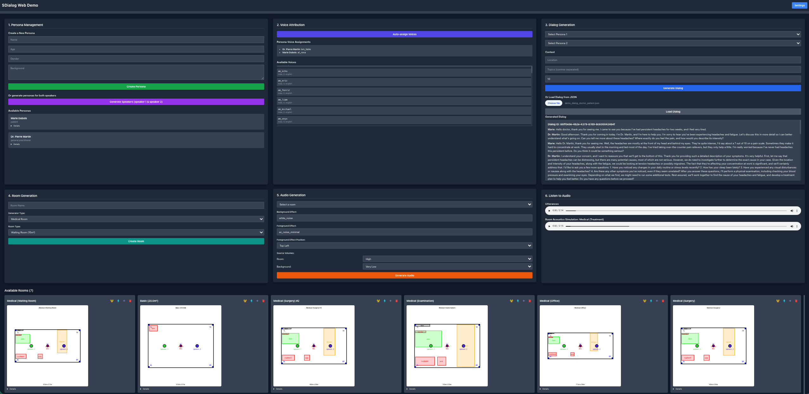

# SDialog Web Demo

This is a web-based demonstration of the `sdialog` library, providing an interactive interface to explore its features for synthetic dialogue generation.



## Features

*   **Persona Management**: Create custom personas or generate them automatically using a language model.
*   **Voice Attribution**: Automatically assign realistic voices to personas based on their characteristics.
*   **Dialog Generation**: Generate rich, multi-turn dialogues between personas with specified context.
*   **Room Generation**: Create virtual rooms with specific dimensions to simulate acoustic environments.
*   **Audio Generation**: Render dialogues as audio, applying room acoustics for added realism. And play back the generated audio clips directly in your browser.

## Setup and Installation

This web application requires Python and depends on the `sdialog` library, which is expected to be installed using `pip install sdialog` or by doing `pip install git+https://github.com/idiap/sdialog.git`, you also need to install `kokoro` like shown in [tutorial 8](https://github.com/idiap/sdialog/tree/main/tutorials) if you plan to generate audio.

### Installation

Navigate to the directory of the demo and install the required packages.
```bash
pip install https://github.com/sdialog/demo.git
cd ./demo
pip install -r requirements.txt
```

### Running the Application

Once the dependencies are installed, you can start the Flask server:

```bash
python app.py
```

The application will be available at `http://0.0.0.0:1231` (or `http://localhost:1231`) in your web browser. You can also change the port if you feel the need to.
